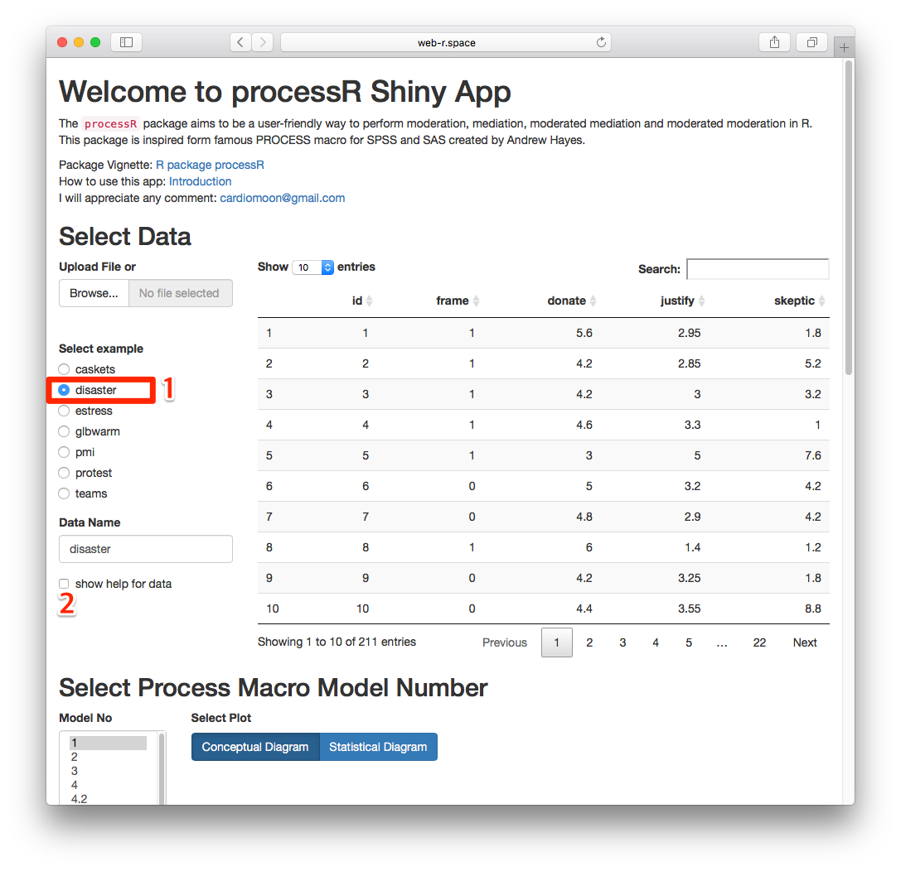
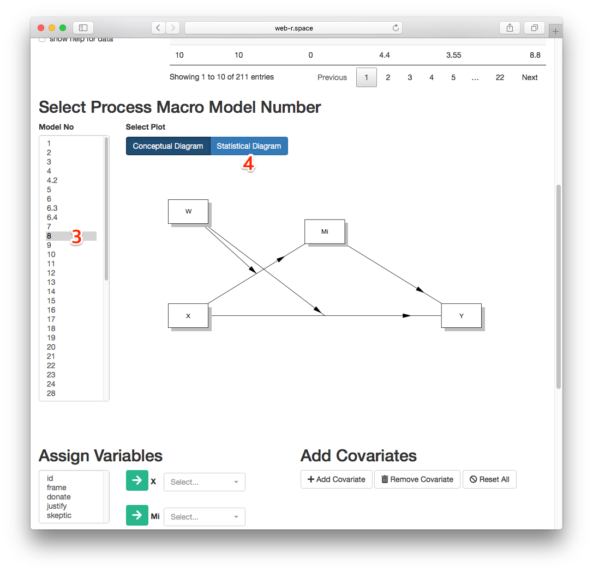
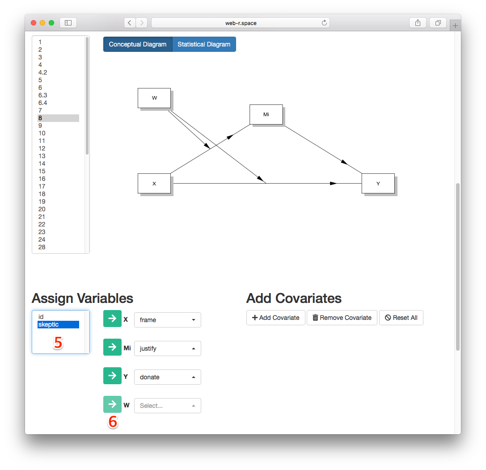
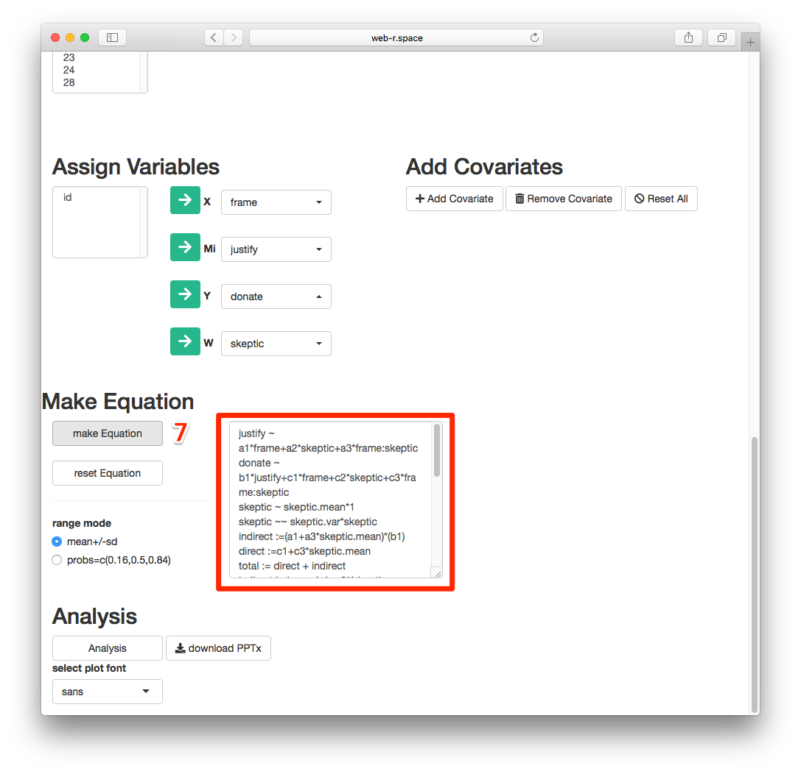
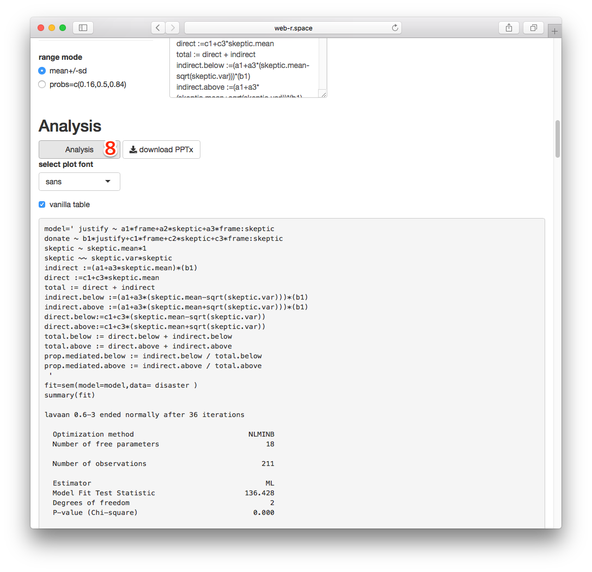
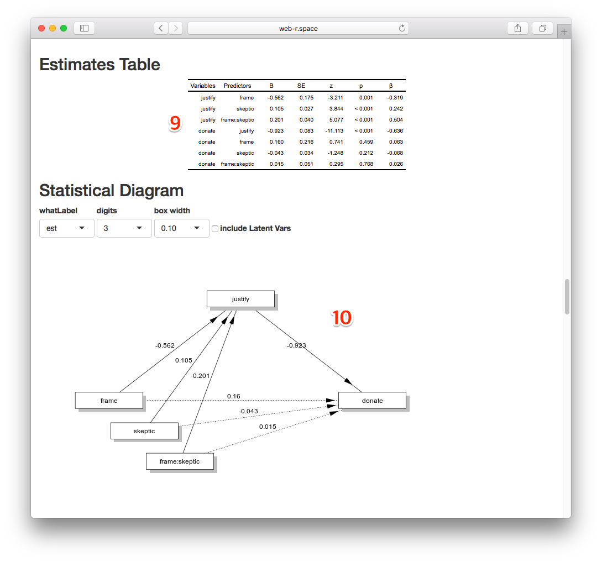
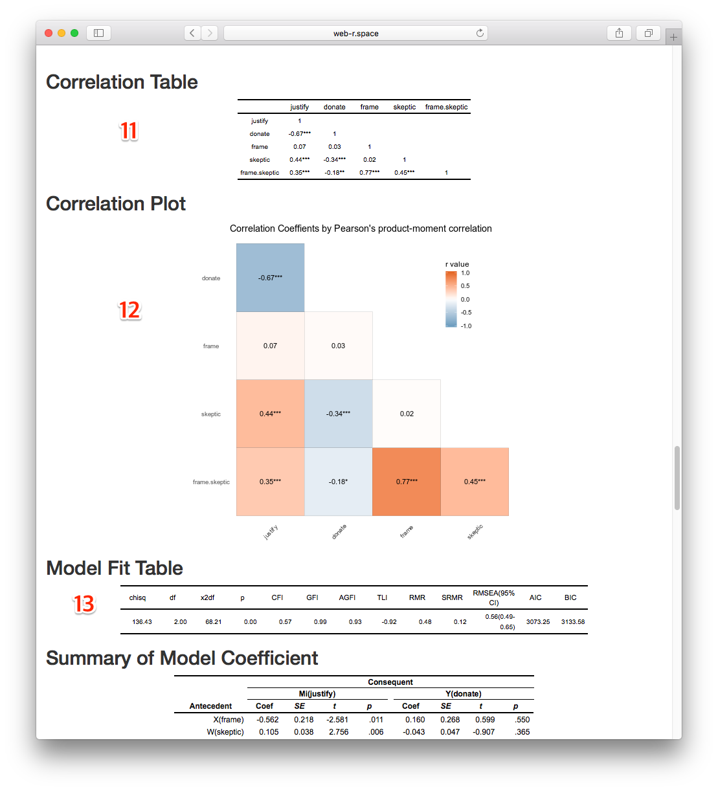
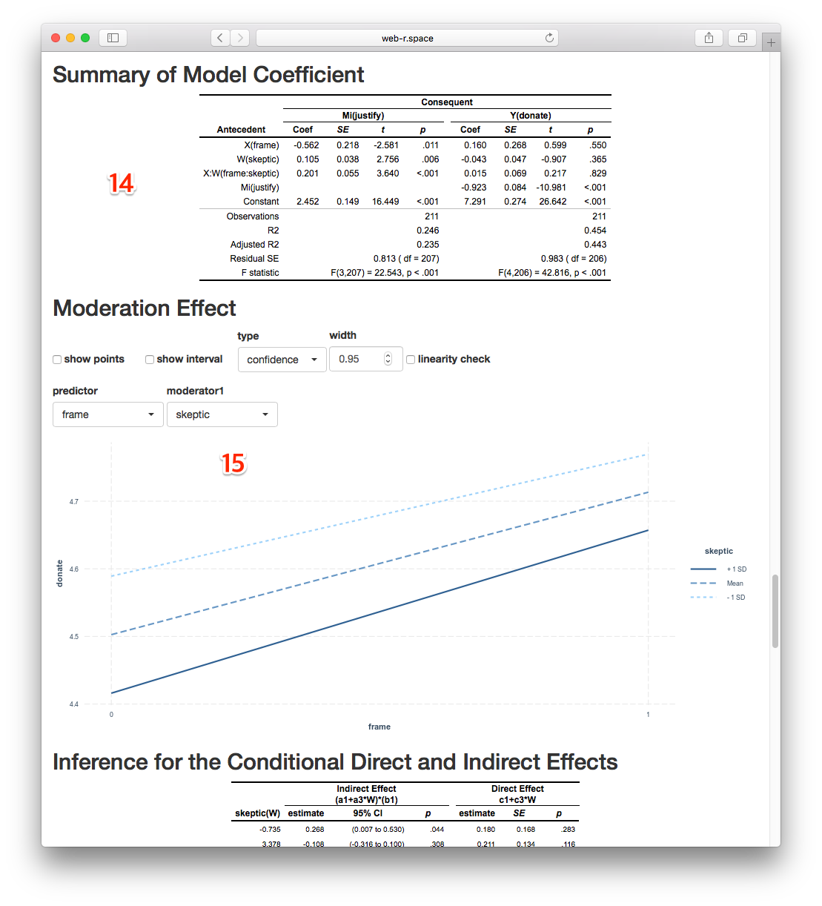
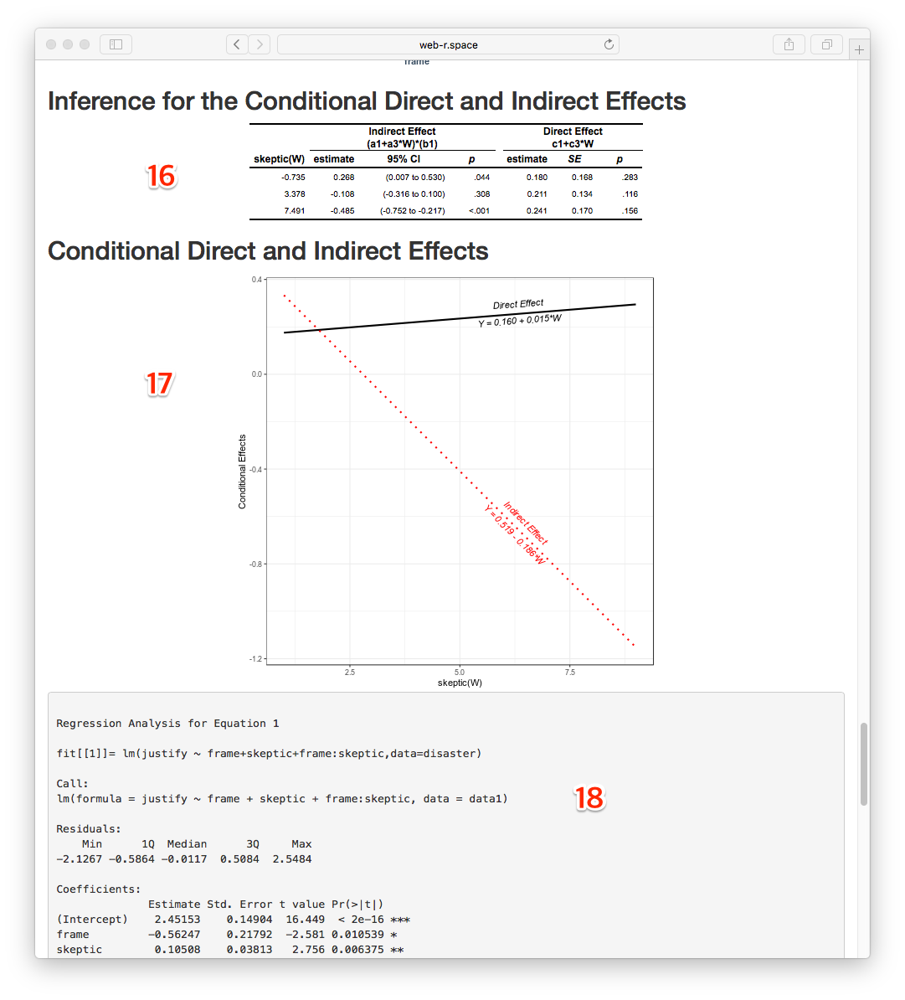
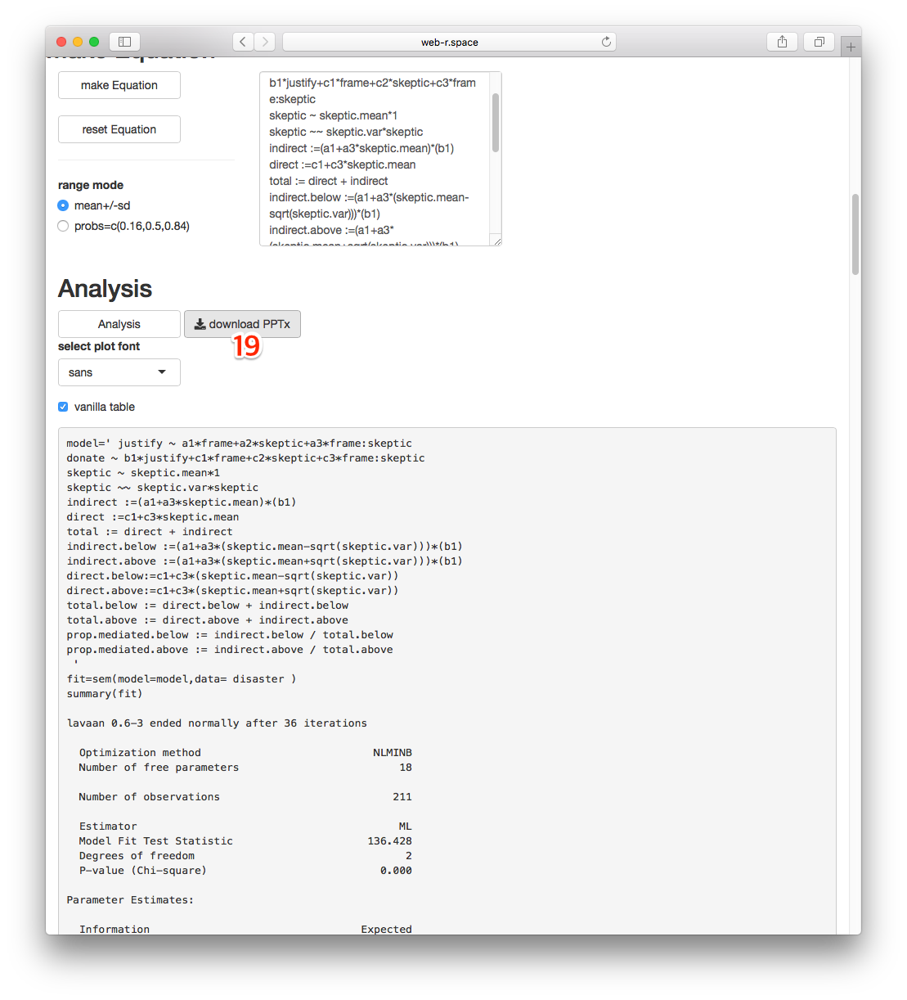

```{r setup, include=FALSE}
knitr::opts_chunk$set(echo = TRUE)
```

## Homepage of processR package

The homepage of `processR` package is https://github.com/cardiomoon/processR. You can see teh package vignette http://rpubs.com/cardiomoon/468602

## Where to start?

Please visit the processR App at http://web-r.space:3838/processR with web browser.

## Select Data

Among the example data, select `disaster` data(1). If you want to see the help for data, click the `show help for data` checkbox(2)



## Select Model Number

Select Process Macro Model Number 8(3). You can see the conceptual diagram. You can see the statistical diagram by press the button(4)  




## Assign Variables

Now, you can assign variables. Select `frame` among variables in the selectInput(5) and press the green arrow named as **X**. Assign `justify` as **Mi**, `donate` as **Y** and `skeptic` as **W**. 



## Make Equation

Press the **make Equation** button(7). The processR app makes the equation for you. You can edit the equation if you want.



## Analyze

Press the **Analysis** Button(8). Please wait for the analysis result. It takes about 1 minutes to perform all analysis. Please be patient until the the results come.



## Watch the results(1)

You can see the results including conceptual diagram, EstimatesTable(9), Statistical Diagram(10). You can select one of **est**(estimated coefficient), **std**(standardized coefficient) or **name**(label).



## Watch the results(2)

You can also see the Correlation Table(11), Correlation Plot(12) and Model Fit Table(13).



## Watch the results(3)

You can see the Summary of Medel Coefficient(14) and Plot for Moderateion Effect(15). Please try several options for moderation plot.



## Watch the results(4)

You can see the inference for the conditional direct and indirect effects(16). Also you can get the plot(17) with the results of anlaysis using `mediation` package.   



## Get the result

You can download the results of analysis as a powerpoint file by press the **download PPTx** button(19). 



## Get/See the sample file

You can get the sample powerpoint file [model8.pptx](https://github.com/cardiomoon/processRDocs/blob/master/model8/model8.pptx?raw=true) - view with [office web viewer](https://view.officeapps.live.com/op/view.aspx?src=https://github.com/cardiomoon/processRDocs/blob/master/model8/model8.pptx?raw=true). All contents in this powerpoint file is editable. The plots in this file is vector graphic. 

## Get/See this file as MS word

You can get this file in a MS word format [model8.docx](https://github.com/cardiomoon/processRDocs/blob/master/model8/model8.docx?raw=true) - view with [office web viewer](https://view.officeapps.live.com/op/view.aspx?src=https://github.com/cardiomoon/processRDocs/blob/master/model8/model8.docx?raw=true) 